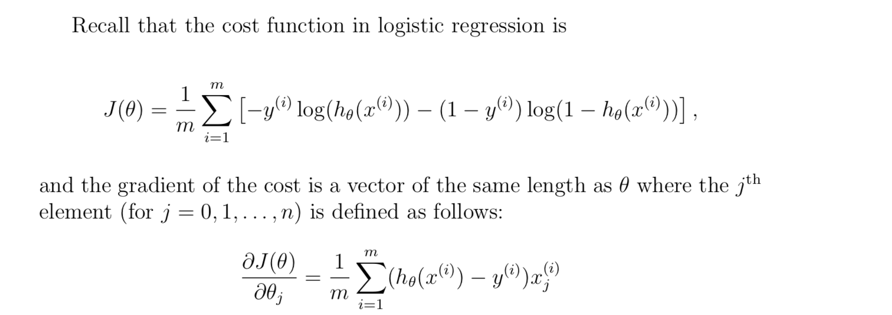

# Logistic-Regression

Suppose that you are the administrator of a university department and you want to determine each applicant’s chance of admission based on their results on two exams. 

You have historical data from previous applicants that you can use as a training set for logistic regression. For each training example, you have the applicant’s scores on two exams and the admissions decision.

Your task is to build a classification model that estimates an applicant’s probability of admission based the scores from those two exams. 

<b>How to Solve</b>

Logistic regression hypothesis is,  hθ(x) = g(θT x) 

where g is sigmoid function, i.e. g(z) = 1 / ( 1 + e ^−z)

For large positive values of x, the sigmoid should be close to 1,  
while for large negative values, the sigmoid should be close to 0. 

    octave:20> sigmoid(0)
    ans =  0.50000
    octave:21> sigmoid(1000)
    ans =  1
    octave:22>

Reference: https://www.coursera.org/learn/machine-learning
